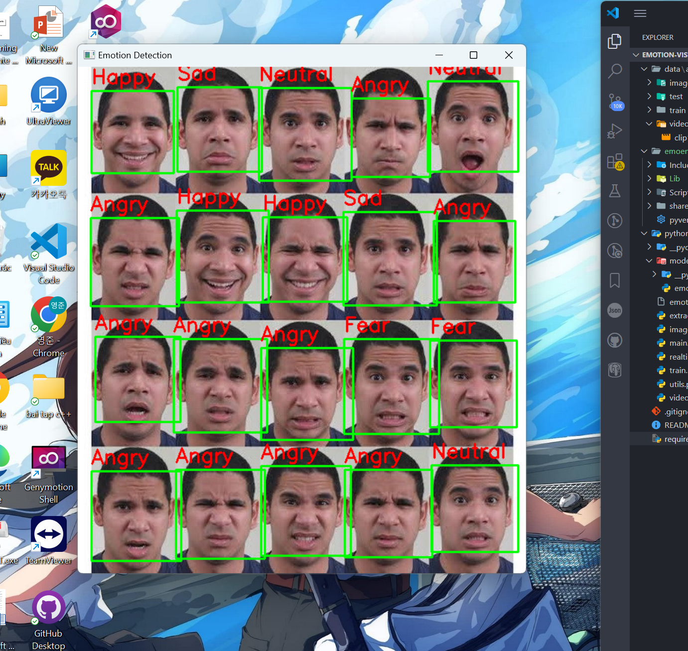

# Emotion Vision - Real-time Facial Emotion Recognition

A real-time facial emotion recognition system using Convolutional Neural Networks (CNN), trained on the FER2013 dataset.

- 📊 **Accuracy**: ~66% on FER2013
- 🎥 **Supports**: Real-time webcam detection, single image inference
- 💻 **Technologies**: Python, OpenCV, TensorFlow/Keras

---

## 🎥 Demo Video on YouTube

[](https://youtu.be/f0YEbnTfm2I)

---

## 😃 Emotion Detection Results

Illustrative image showing emotion classification results on multiple faces:



---

## 🚀 Features

- Emotion detection: `Angry`, `Disgust`, `Fear`, `Happy`, `Sad`, `Surprise`, `Neutral`
- Real-time emotion classification via webcam
- Emotion detection from static images
- Pretrained CNN model on **FER2013** dataset
- Supports retraining with new data

---

## 🛠️ Installation & Usage

### ✅ Requirements

- Python 3.x
- Libraries:
  - `tensorflow`
  - `opencv-python`
  - `mediapipe`
  - `numpy`, `matplotlib`, `pandas`, `scikit-learn`, `dlib`, ...

> Install all with:

```bash
pip install -r requirements.txt
```

---

### 📦 Setup

Clone the repository:

```bash
git clone https://github.com/mdt190100/emotion-vision.git
cd emotion-vision
```

Install dependencies:

```bash
pip install -r requirements.txt
```

---

## 📸 Run Real-time Emotion Detection

```bash
python video_emotion_demo.py
```

> The system will activate the webcam and display the recognized emotion in real time.

---

## 🖼️ Emotion Detection from Image

```bash
python image_emotion_demo.py <path_to_image>
```

Example:

```bash
python image_emotion_demo.py ./images/test_face.jpg
```

---

## 🧠 Train New Model

1. Download the [FER2013 dataset from Kaggle](https://www.kaggle.com/c/challenges-in-representation-learning-facial-expression-recognition-challenge/data)

2. Place the `fer2013.tar.gz` file in the `datasets/` directory

3. Extract the dataset:

```bash
tar -xzf fer2013.tar.gz -C datasets/
```

4. Train the model:

```bash
python train_emotion_classifier.py
```

Model weights will be saved in the `models/` directory

---

## 📁 Project Structure

```
emotion-vision/
├── datasets/                 # Dataset files
├── images/                   # Sample images and demo gifs
├── models/                   # Trained models saved here
├── train_emotion_classifier.py
├── video_emotion_demo.py     # Real-time demo
├── image_emotion_demo.py     # Single image demo
├── utils.py                  # Helper functions
├── requirements.txt
└── README.md
```

---

## 📚 References

- FER2013 Dataset: [Kaggle Challenge](https://www.kaggle.com/c/challenges-in-representation-learning-facial-expression-recognition-challenge)
- Original FER2013 Paper: [Link PDF](https://www.vision.caltech.edu/~ikim/FER2013.pdf)

---
